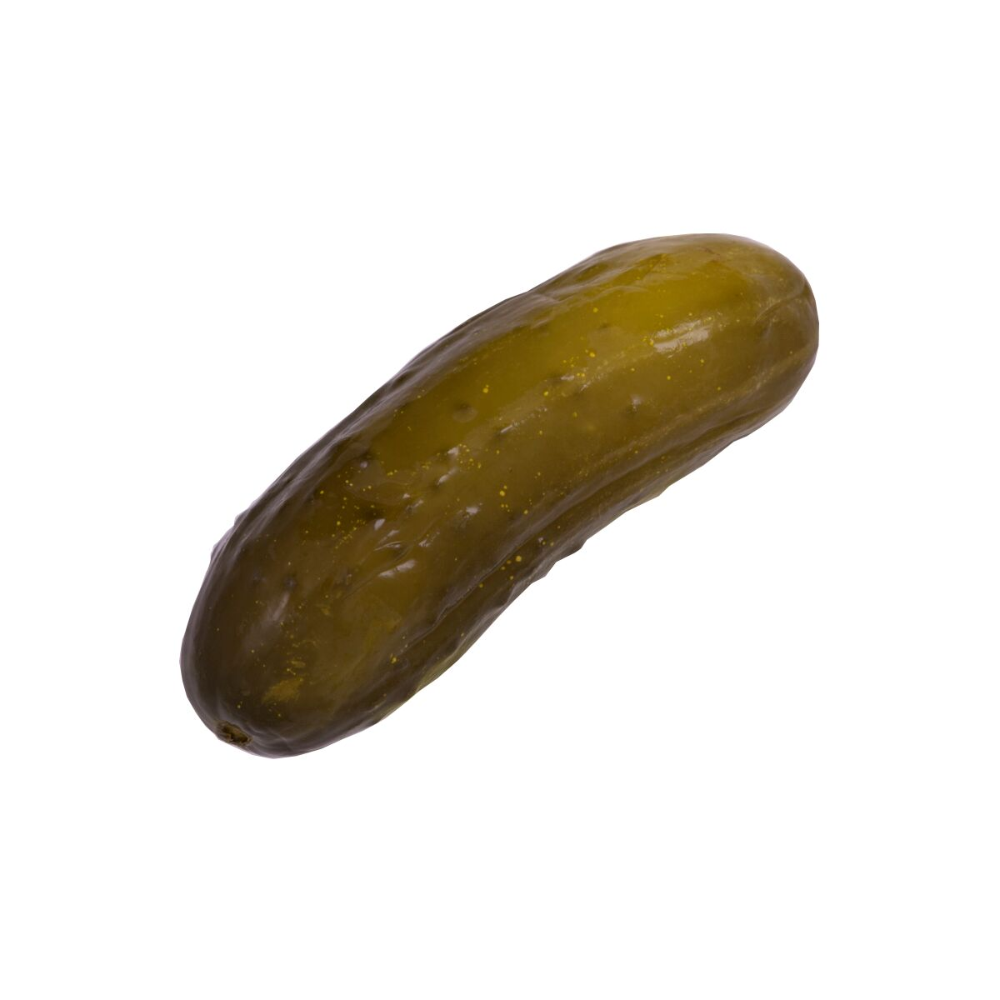

# Mr Landon's IST Portfolio

[Landon's IST Portfolio](https://github.com/DookieMan72/ist-portfolio-Landon)

This is my super duper amazing portfolio. I still don't really know what this is for but I suppose it's kinda cool. :cowboy_hat_face::cowboy_hat_face::cowboy_hat_face::cowboy_hat_face::cowboy_hat_face::cowboy_hat_face::cowboy_hat_face::cowboy_hat_face::cowboy_hat_face::cowboy_hat_face::cowboy_hat_face::cowboy_hat_face::cowboy_hat_face::cowboy_hat_face::cowboy_hat_face::cowboy_hat_face::cowboy_hat_face::cowboy_hat_face::cowboy_hat_face::cowboy_hat_face::cowboy_hat_face::cowboy_hat_face::cowboy_hat_face::cowboy_hat_face::cowboy_hat_face::cowboy_hat_face::cowboy_hat_face::cowboy_hat_face::cowboy_hat_face::cowboy_hat_face::cowboy_hat_face::cowboy_hat_face::cowboy_hat_face::cowboy_hat_face::cowboy_hat_face::cowboy_hat_face::cowboy_hat_face::cowboy_hat_face::cowboy_hat_face::cowboy_hat_face::cowboy_hat_face::cowboy_hat_face::cowboy_hat_face::cowboy_hat_face::cowboy_hat_face::cowboy_hat_face::cowboy_hat_face::cowboy_hat_face::cowboy_hat_face::cowboy_hat_face::cowboy_hat_face::cowboy_hat_face::cowboy_hat_face::cowboy_hat_face::cowboy_hat_face::cowboy_hat_face::cowboy_hat_face::cowboy_hat_face::cowboy_hat_face::cowboy_hat_face::cowboy_hat_face::cowboy_hat_face::cowboy_hat_face::cowboy_hat_face::cowboy_hat_face::cowboy_hat_face::cowboy_hat_face::cowboy_hat_face::cowboy_hat_face::cowboy_hat_face::cowboy_hat_face::cowboy_hat_face::cowboy_hat_face::cowboy_hat_face::cowboy_hat_face::cowboy_hat_face::cowboy_hat_face::cowboy_hat_face::cowboy_hat_face::cowboy_hat_face::cowboy_hat_face::cowboy_hat_face::cowboy_hat_face::cowboy_hat_face::cowboy_hat_face::cowboy_hat_face::cowboy_hat_face::cowboy_hat_face::cowboy_hat_face::cowboy_hat_face::cowboy_hat_face::cowboy_hat_face::cowboy_hat_face::cowboy_hat_face::cowboy_hat_face::cowboy_hat_face::cowboy_hat_face::cowboy_hat_face::cowboy_hat_face::cowboy_hat_face::cowboy_hat_face::cowboy_hat_face::cowboy_hat_face::cowboy_hat_face::cowboy_hat_face::cowboy_hat_face::cowboy_hat_face::cowboy_hat_face::cowboy_hat_face::cowboy_hat_face::cowboy_hat_face::cowboy_hat_face::cowboy_hat_face::cowboy_hat_face::cowboy_hat_face::cowboy_hat_face::cowboy_hat_face::cowboy_hat_face::cowboy_hat_face::cowboy_hat_face::cowboy_hat_face::cowboy_hat_face::cowboy_hat_face::cowboy_hat_face::cowboy_hat_face::cowboy_hat_face::cowboy_hat_face::cowboy_hat_face::cowboy_hat_face::cowboy_hat_face::cowboy_hat_face::cowboy_hat_face::cowboy_hat_face::cowboy_hat_face::cowboy_hat_face::cowboy_hat_face::cowboy_hat_face::cowboy_hat_face::cowboy_hat_face::cowboy_hat_face::cowboy_hat_face::cowboy_hat_face::cowboy_hat_face::cowboy_hat_face::cowboy_hat_face::cowboy_hat_face::cowboy_hat_face::cowboy_hat_face::cowboy_hat_face::cowboy_hat_face::cowboy_hat_face::cowboy_hat_face::cowboy_hat_face::cowboy_hat_face::cowboy_hat_face::cowboy_hat_face::cowboy_hat_face::cowboy_hat_face::cowboy_hat_face::cowboy_hat_face::cowboy_hat_face::cowboy_hat_face::cowboy_hat_face::cowboy_hat_face::cowboy_hat_face::cowboy_hat_face::cowboy_hat_face::cowboy_hat_face::cowboy_hat_face:

The basic git commands to update this repo are:
```
git add .
git commit -m "commit message"
git push
```



To autocomplete filenames in vim 
- Ctrl+x Ctrl+f
- Ctrl+n to cycle through options
